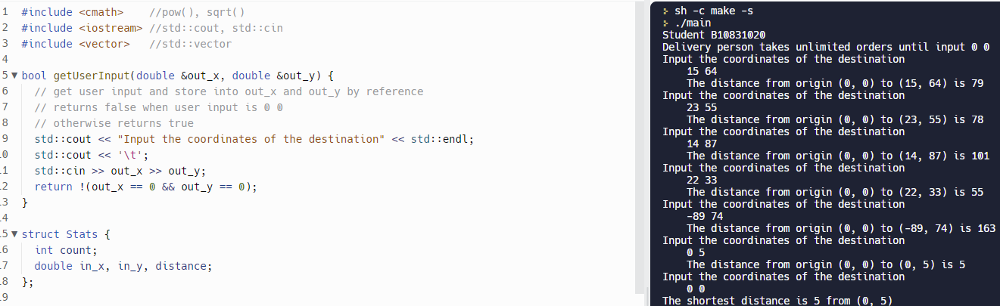

# Homework 0 曼哈頓距離

| 班級     |    學號   | 姓名    |
| :---:    |   :---:   | :---:  | 
| 四機械四乙| B10831020 | 吳宇昕  |
>日期 9/27/2022
## Task3：外送員
>[Sorce Code](CODE\hw0A.cpp)以及[Replit網址](https://replit.com/join/qlsxzvdqlm-b10831020)
>
>* 手動輸入座標終端機輸出
>
> * 自定義```struct Stats```存放每筆輸入資料
 ```c++
struct Stats
{
    int count;
    double in_x, in_y, distance;
};
```
> * 用```vector<Stats>```儲存每筆輸入與距離，可以容納無數筆輸入
> * 當輸入為```0 0```結束程式並顯示最短距離與出發座標
> * 利用pass by reference從函式輸出變數值
 ```c++
 bool getUserInput(double &out_x, double &out_y)
{
    //get user input and store into out_x and out_y by reference
    //returns false when user input is 0 0
    //otherwise returns true
    std::cout << "Input the coordinates of the destination" << std::endl;
    std::cout << '\t';
    std::cin >> out_x >> out_y;
    return !(out_x == 0 && out_y==0);
}
 ```
> * 以```while(getUserInput(x, y))```持續接收使用者輸入。當使用者輸入0 0，```getUserInput```函式將return false中止while迴圈。
## 心得
> 嘗試使用struct存放每一筆輸入值，然而對其用法相當不熟悉。原本想call它的default constructor，初始化struct
```c++
userInput thisInput = userInput(x, y, count, distance)
```
> 卻產生錯誤。只好一個個attribute個別賦值，寫出相當冗贅的程式。
 ```c++
 thisInput.x = x;
 thisInput.y = y;
 thisInput.count = count;
 thisInput.distance = distance;
 ```
> struct的用法似乎跟class仍不盡相同，或是其實我在這之中寫錯了有所誤會。開始寫c++後才漸漸理解為何現今多個程式語言朝物件導向的語法發展。畢竟像c一樣的語法實在不太平易近人。
> 
> 很高興自己事先已經會操作vscode，設置開發環境與compiler。Vscode實在是很方便使用的文字編輯器，除了寫程式，寫markdown也很輕鬆。