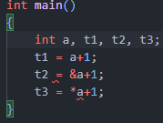
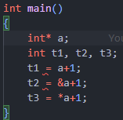

# 大哉問

| 班級     |    學號   | 姓名    |
| :---:    |   :---:   | :---:  | 
| 四機械四乙| B10831020 | 吳宇昕  |
> 日期 9/25/2022

## 差異int[]與int*
### Q1 - 宣告[int a或int* a]，a = 100及 [ int t1,t2,t3或int* t1,t2,t3 ]，觀察以下3種情況是否出錯
* t1 = a+1;
* t2 = &a + 1;
* t3 = *a + 1;

### 1. 宣告```int a```

> 
> 
> 第二行錯誤，因為其試圖取a的記憶體位置，偏移1 byte，並將偏移後的憶體位置賦予t2。然而t2並非pointer，不能直接儲存記憶體位置
>
> 第三行錯誤，因為*在等號右側的意義是dereference，應作用於pointer上取該記憶體位置的值。a並非pointer，無法被dereference

### 2. 宣告```int* a```
> 
>
> ```a```是個pointer，指向某個整數的記憶體位置

> 第一行錯誤，因其試圖將```a```所指的記憶體位置偏1 byte，並將偏移後的記憶體位置賦予```t1```。然而```t1```並非pointer，無法直接儲存記憶體位置
> 
> 第二行錯誤，因其試圖取```a```該pointer本身的記憶體位置，偏移1 byte並賦予t2。然而```t2```無法直接存放記憶體位置
> 
> 第三行可能產生runtime error。因為其取```a```所指向的記憶體位置之整數，該整數+1後賦予```t3```。然而```a```宣告時並未設定初始值，runtime會產出無法預測的數值

> 若要修正，可以把```t1```與```t2```宣告為```int*```。

### 3. ```int[]```與```int*```差異
> ```int[]```用於陣列indexing。陣列是一段連續的記憶體空間，每個元素體積相同。因此使用```[]```索引元素，電腦可以自行推斷應從該陣列的開始處，偏移多少個byte找到該元素。例如
> ```c++
> int a[5] = {0};
> a[3];
> ```
> ```a[3]```電腦會從陣列```a```記憶體片段開始處偏移3*4個byte，找到index為3的元素。
>
> ```[]```只能偏移某type之記憶體大小的整數倍個byte，而```*```可以任意決定偏移數量。例如
> ```c++
> int b = 0;
> int* a = &b;
> a = a+999;
> ```
> 可以自行決定原指向```b```記憶體位置的pointer ```a```偏移999個byte。

### Q2 - W3講義第一頁的swap2A及swap2B 有甚麼差異?
> ```swap2A```與```swap2B```將會輸出同樣的結果，但是兩者使用的原理不同。

> ```swap2A```輸入```px```與```py```兩個pointer，個別dereference取值後交換變數值。```swqp2B```則是利用```[]```運算子對輸入的pointer偏移0個byte，並且取值交換。