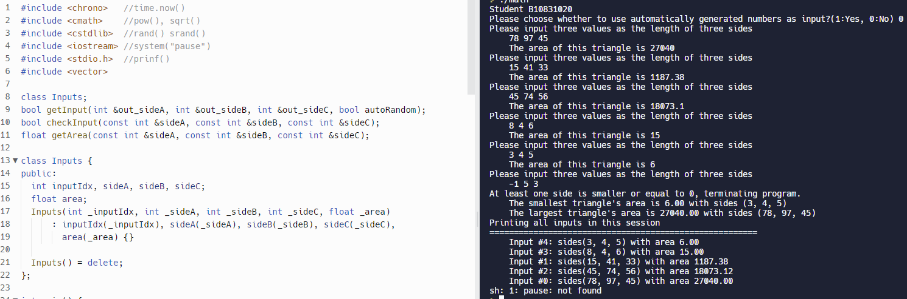

# Homework 1


| 班級     |    學號   | 姓名    |
| :---:    |   :---:   | :---:  | 
| 四機械四乙| B10831020 | 吳宇昕  |
>日期 9/27/2022

## Task 1：三角形
>[Sorce Code](CODE/hw1.cpp)以及
>[Replit網址](https://replit.com/join/aemuvrnzpi-b10831020)

>* 手動輸入三邊長之終端機輸出
> 
>* 自動判斷三邊長是否合適。若三邊長其中一者為0、負數或三者長度無法組成三角形，程式終止
>* 當三邊長可組成三角形，計算並顯示其面積
>* 可以接收無限多筆輸入
>* 使用```while loop```
>* 自定義函式採```void pass by reference```及```pass by value```多種形式。若函式不須修改變數值，採```void pass by const reference```提升效能，避免複製變數值占用記憶體空間
```c++
bool getInput(int& out_sideA, int& out_sideB, int& out_sideC, bool autoRandom);
bool checkInput(const int& sideA, const int& sideB, const int& sideC);
float getArea(const int& sideA, const int& sideB, const int& sideC);
```


## Task２：使用```vector```儲存數據
>* 自動產生亂數作為三邊長
>* 自定義```class Inputs```儲存單筆輸入之三邊長與其三角形面積，並以```vector<Inputs*>```儲存各比輸入
```c++
class Inputs
{
public:
    int inputIdx ,sideA ,sideB ,sideC;
    float area;
    Inputs(int _inputIdx, int _sideA, int _sideB, int _sideC, float _area):
        inputIdx(_inputIdx),
        sideA(_sideA),
        sideB(_sideB),
        sideC(_sideC),
        area(_area)
        {}

    Inputs() = delete;
};

```
>* 使用```for loop```與‵```auto```印出所有資料
```cpp
for(auto ptr : inputLog){ //print all inputs in this session
       printf("\tInput #%d: sides(%d, %d, %d) with area %.2f\n", ptr->inputIdx, ptr->sideA, ptr->sideB, ptr->sideC, ptr->area);
```
 利用```srand()```與```rand()```函式自動產生亂數作為三邊長輸入
```c++
std::cout << "Generating side lengths from random numbers" << std::endl;
std::cout << '\t';
auto currentTimeStamp = std::chrono::steady_clock::now().time_since_epoch().count();
srand((uint64_t)currentTimeStamp);
out_sideA = abs(rand() % 10);
out_sideB = abs(rand() % 10);
out_sideC = abs(rand() % 10);
printf("The sides are (%d, %d, %d)", out_sideA, out_sideB, out_sideC);
```

## 心得
> 這份作業試圖使用pointer以及pass by reference等技巧，將vector```inputLog```傳進自定義的函式，然而過程相當不順利。查看網路上許多相關教學，似乎這樣做不應該出任何問題，親自嘗試時debugger卻產生看不懂的錯誤訊息。無論是pass by reference或pass by value，都產生compile time error。由於需準時繳交作業，只好暫時放棄把vector傳進函式。希望之後能夠釐清自己的錯誤，學會使用相關技巧提升程式效能。

> 很高興終於理解C++中```*```以及```&```的意義，看到別人的程式碼時將不再會毫無頭緒不知所措。過去在寫python script缺乏pointer觀念，利用pointer程式很容易產生segfault以及各種莫名奇妙的bug。經過訓練，希望可以更熟練。
