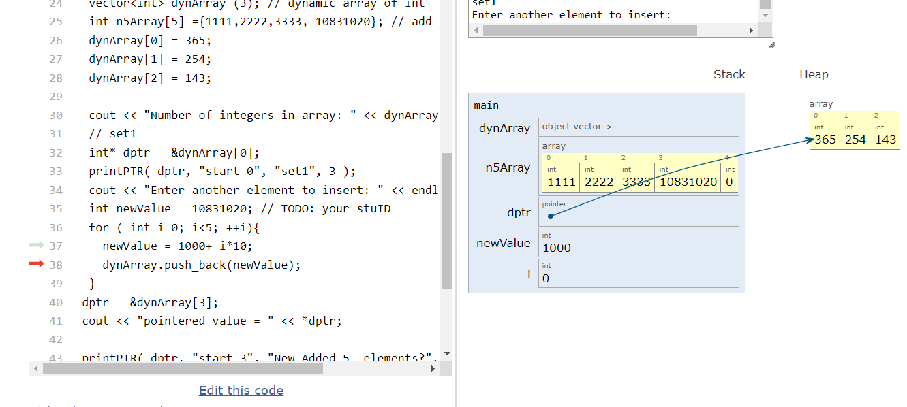
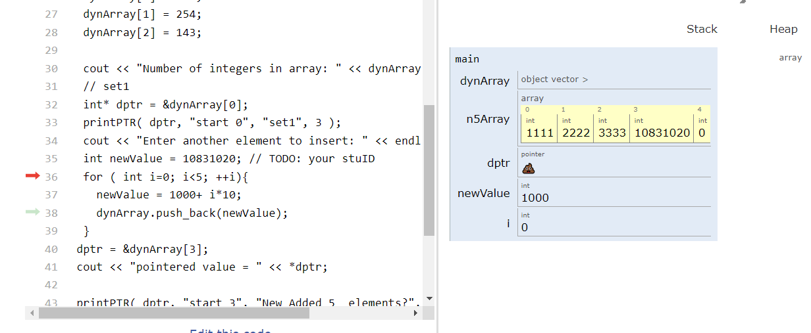
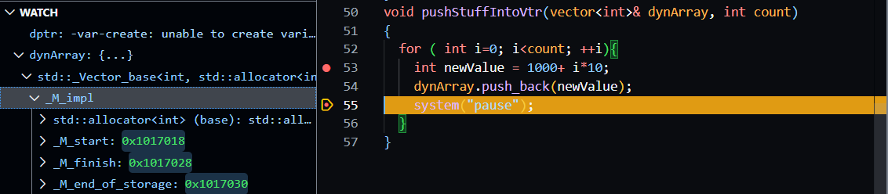

# Homework 2 Part 1
## Dynamic array tutor2.cpp

|  班級   |  學號    |  姓名  |
|  :---:  |  :---:  |  :---:|
|四機械四乙|B10831020|吳宇昕  |

[sorce code](CODE/DynArrayTutor2.cpp) and [replit url](https://replit.com/join/wxydphnzcy-b10831020)

### Q1: 將函式變數由 int* 改為 int[]
> 兩種情況下，函式都能正常運作。迴圈最後一行使用的```++```運算子作用於int pointer時，每次都會自動偏移4個byte，也就是int的大小。因此無論函式的引述宣告為```[]```或```*```都可以順利執行。

### Q2: 把push_back的for loop寫成函式
```c++
void pushStuffIntoVtr(vector<int>& dynArray, int count)
{
  for ( int i=0; i<count; ++i){
    int newValue = 1000+ i*10;
    dynArray.push_back(newValue);
  }
}
```
> Vector以pass by reference方式傳入函式，方便修改其記憶體位置的值。同時，pass by reference可以避免複製整個vector至另一個函式的stack frame，節省記憶體使用量。

## 心得
> 這項作業介紹了tutor這良好的工具，可以視覺化呈現各個變數的數值，以及pointer所指向的位置。甚至當pointer正指向一個無效的記憶體位置時，還會顯示屎的表情符號，清楚呈現一個失控的pointer可以摧毀人的一天。
>
> 其中有個問題讓我花了非常多時間理解，就是為何原程式執行37行以前，```dptr```是有效的，但是```dynArray```一旦被38行加入新值之後，馬上失效? 下圖為```dynArray```被38行```push_back```之前情形，```dptr```仍是有效的pointer
> 
> 下圖為38行```push_back```以後，```dptr```已經失效
> 
> 在vscode仔細檢查前後```dynArray```記憶體位置後，才發現vector被```push_back```之後，它的記憶體位置可能會截然不同。下圖顯示```push_back```前```dynArray```的起始記憶體位置，是```0x1011630```
> 
> 下圖顯示```push back```之後```dynArray```起始記憶體位置，是```0x1017018```，前後相距甚遠。
> 
> 由於vector需要找更大的記憶體空間容納新進數值，它會在heap上找出一個比原vector大一點的記憶體空間，把舊有的數值複製過去，並將新數值放入新記憶體位置的最後一個空間。```dptr```在程式執行到```dptr = &dynArray[3]```以前完全不知道vector的記憶體位置更新過，傻傻的指向舊的、已經過時被清除的```dynArray```的位置。因此被tutor標記為失控的pointer。
>
> 在電腦所有記憶體耗盡前，vector似乎可以無限增長，但是持續讓它配置新記憶體空間、複製舊有值、回傳新記憶體位置，恐怕會傷害程式效能。