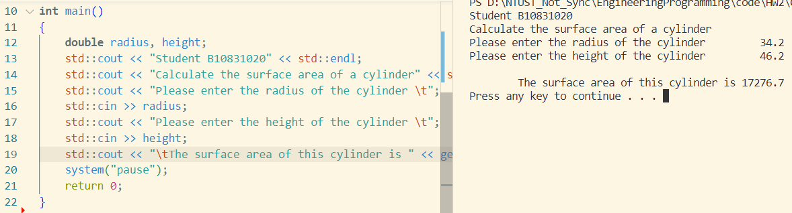
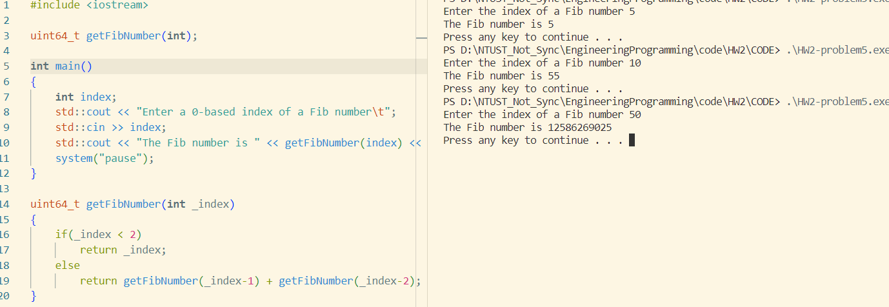
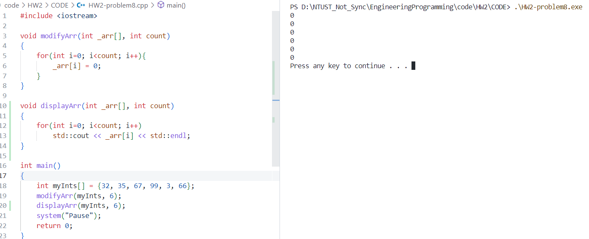

# Homework 2 part 2

|  班級   |  學號    |  姓名  | 日期 |
|  :---:  |  :---:  |  :---:| :---: |
|四機械四乙|B10831020|吳宇昕  | 10/1/2022|

## Problem 2 宣告函式計算表面積
[sorce code](CODE/HW2-problem2.cpp)
```c++
double getSurfaceArea(double _radius, double _height)
{
    const double pi = 3.14159;
    return 2*pi*_radius*_height + 2*pow(_radius, 2)*pi;
}
```
> ```main()```與終端機輸出
> 
> 善用函式可以大幅增進程式的可讀性，把許多與整體應用程式邏輯脈絡無關的內容移至```main()```函式之外。一個函式應該只負責一項很鮮明的工作，不應該試圖讓同一函式身兼多職。把不同功能寫在不同函式裡，讓函式看起來意義更明顯，也更方便命名。

## Problem 5 函式自我呼叫、迭代
[sorce code](CODE/HW2-problem5.cpp)
> 終端機輸出
> 
> * 回傳值使用```uint_64t```減緩memory overflow
>
> 尋找Fibonacci number的函式執行時間隨輸入index增加而指數上升，要找第50個Fibonacci number時明顯感受到電腦需要花相當久的時間才能找到。若C++函式沒有自我呼叫的功能，找Fibonacci number的函式恐怕會複雜得多，甚至有點不知道怎麼寫。
>
> 曾經聽說寫微電腦的程式應該避免使用迭代的技巧，以免它們計算資源不足，記憶體耗盡。若是有辦法，之後我會更注意。

## Problem 8 
[sorce code](CODE/HW2-problem8.cpp)
> 終端機輸出
> 
> 將陣列傳入```modifyArr()```與```displayArr```兩函式，以陣列本身以及其大小作為函式的引數。
> 一般的陣列跟現在c++的standard array可以像這樣將其傳入一函式，並修改其值，vector卻不行。由於vector只要增長，其記憶體位置就可能改變，不像array的記憶體位置是固定的，要在函式中修改vector必須將其pass by reference。