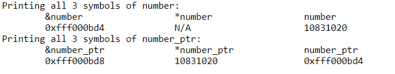
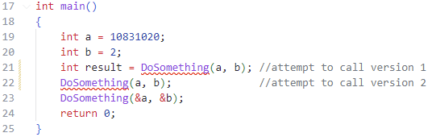

# Homework 3
 |  班級   | 姓名 |  學號   |   日期   |
 |   :---: | :---:|  :---:  |:---: |
 |四機械四乙|吳宇昕|B10831020|10/13/2022|

## __Part 1 Problem A__
### Copy a const int pointer to non-const pointer 
[test code](CODE/Part1/HW3A.cpp)
> 欲複製const pointer，必須將其儲存於另一個const pointer。若新的pointer並非const，則會產生compile time error。
>
> 
>
> 原本預期c++的```mutable```關鍵字可以暫時避免compiler設下的這道防護機制，強迫其將```const int*```複製給```int*```但是發現這樣做沒有用。看來mutable關鍵字是專門用來讓class裡的const函式修改class member用的，無法像我這樣使用。
> 
> 

## __Part 1 Problem B__
### Why should I pass variables as reference
[test code](CODE/Part1/HW3B.cpp) and [replit](https://replit.com/join/wogevlomwv-b10831020)
> 變數被pass by value進到函式時，將會在該函示的stack frame裡產生其數值的副本。複製體積大的變數或物件時，將會耗費CPU資源以及記憶體空間。
> 若是pass by reference，函式接收到的是該物件或變數的記憶體位置，只需要到該位置取值運算，不需要複製整個變數值進自己的stack frame。
>
> 我用```chrono```套件量測將一個含有100000個double的vector pass by value與pass by reference進到函式裡，並修改其值需花費的時間。
> vector宣告如
> ```c++
> std::vector<double> largeVtr(100000)
> ```
>
> Pass by reference 與 pass by value 兩測試函數參數如
> ```c++
> void passedByRef(std::vector<double>& _largeVtr)
> void passedByValue(std::vector<double> _largeVtr)
> ```
>
> 實驗使用的 [test code](CODE/Part1/HW3B.cpp)在此。
> 發現在g++ compiler優化前，兩個版本的函式各執行1000次平均時間差0.0113839秒，而開啟g++ compiler優化```-O3```選項後，差距為0.00413375秒。若是體積更大的object需要被反覆傳入函式，更可以觀察出pass by value與pass by reference的效能差異。
> 
> 簡單地在函式參數列加入& pass by reference就可以顯著提升程式效能，以後將會善用此語法。

## __Part 1 Problem C__
### What are the difference between ```int myInt[10]``` and ```int* myInt[10]```
[test code](CODE/Part1/HW3C.cpp)
> 前者會在stack上配置一段連續的記憶體，長度40bytes，並取得指向此段記憶體起點的pointer，可以在此寫入10個int數值。後者在stack上建立10個連續的int pointer，分別指向零散、非連續的記憶體位置。
> 後者做任何數值運算，需要dereference陣列的每個元素。未經dereference，會出現compile time error
> 
> 
> 
> 然而，原本預期dereference各個元素之後就可以對其賦值，實際操作卻出現runtime error，segmentation fault。
> 
> 
> 
> 從vscode檢視記憶體位置，可以看見```int* arr_ptr[10]```配置的10個整數pointer指向記憶體各處，各個整數的記憶體位置凌亂。甚至```[0]```跟```[2]```__指向相同的記憶體位置__:
> 
> 
> 
> 這10個int pointer需要另外再指定其指向的位置，不然現在的樣子沒辦法使用。
> 
> 這種語法似乎很容易產生segfault，之後應該會避免配置一個充滿pointer的陣列。同時由於各個pointer指向記憶體四處，int的數值位置凌亂，程式效能可能較記憶體連續的```int arr[10]```差。


## __Part 1 Problem D__
### Workshop
[test code](CODE/Part1/HW3D.cpp) and [replit](https://replit.com/join/rbiugzgkui-b10831020)
> 宣告變數，得到下圖的輸出
> ```c++
>  int number = 10831020;
>  int* number_ptr = &number;
>  int* number_ptr2 = number_ptr;
> ```
> 
> 
> 
> 可以發現```&number```與```number_ptr```顯示相同的記憶體位置，而```number```與```*number_ptr```顯示相同值。```number_ptr```本身也有記憶體位置，但是與```number```的記憶體位置無關，為任意數。其指向的記憶體位置必與```&number```相同。
> 由於```*number```沒有意義，圖中print```*number```的欄位以hard code在程式碼裡的```N/A```代替，才能順利執行。

## __Part 1 Problem E__
### Overloading functions
[test code](CODE/Part1/HW3E.cpp)
> 宣告三個版本的函式，positional arguments採用不同的type產生overload效果。呼叫函式時，compiler會以傳入的變數的type自動決定應該使用哪個版本的函式。
```c++
int DoSomething(int a, int b);
void DoSomething(int& a, int& b);
void DoSomething(int* a, int* b);
```
> 三個版本分別傳入引數值、引數的reference，以及引數的記憶體位置(或指向引數記憶體位置的pointer)。以三種call signature分別呼叫
```c++
int result = DoSomething(a, b); //attempt to call version 1
DoSomething(a, b);              //attempt to call version 2
DoSomething(&a, &b);            //attempt to call version 3
```
> 原本預期三種call signature都可以順利執行，卻發現compiler無法從有無return type判斷前兩種call signature分別該呼叫哪個版本的函式，因此發生compile time error。
> 
> 

## __Part 2__
 [sorce code](CODE/Part2/HW3P2.cpp) and [replit](https://replit.com/join/ntaqjzlkdi-b10831020)
### __終端機輸出:__
 >
 > 

### __二維vector陣列定義__
 > 
### __用```cstdlib```產生亂數__
 > ```srand(time())```將執行當下的時間點作為random seed，讓每次程式執行得到不同亂數值。然而由於```time()```的時間解析度只有1秒，1秒內的random seed相同，這份程式一秒內執行多次將得到一樣的變數值。若要解決此問題，則需使用```chrono```函式庫中的```steady_clock```高解析度時鐘作為random seed。用亂數賦予矩陣元素值程式如下:
 ```c++
 void AssignRandomValues(matrixVtr& _m1, matrixVtr& _m2, const int n_rows, const int n_cols)
{
    srand(time(0)); //use a time stanp as random seed
    _m1.reserve(n_rows); //allocate 4 vectors of ints
    _m2.reserve(n_rows); //allocate 4 vectors of ints
    for(int i=0; i<n_rows; i++){
        _m1[i].reserve(n_cols); //allocate 4 ints within each row vector
        _m2[i].reserve(n_cols); //allocate 4 ints within each row vector
        for(int j=0; j<n_cols; j++){
            _m1[i].push_back(rand() % 200 - 100);
            _m2[i].push_back(rand() % 200 - 100);
        }
    }
}
 ```
 >> ```rand() % 200 - 100```確保亂數值皆落於[-100, 100]範圍內。
### __心得__
 > 從這題學會了```using```的用途。原本預期```using```應該只是取type代稱用的，沒想到光是幫type取代稱，就可以做出幾乎是新的type出來。像是這份作業把一維的vector，透過兩個```using```指令巢狀包覆vector，產生行數列數皆可增減的二維矩陣，實在相當方便。
 >
 > 上次老師提到希望我們的```main()```更簡潔，這份作業我盡力精簡```main()```內容，在13行內寫完函式主體。
 > 
 > 然而無法同時達成老師希望print用在```main()```裡面，而不在local function裡的要求。需要另外寫```PrintMatrix```函式處理終端機輸出陣列，不然把所有```print```寫在```main()```裡會大幅增加其體積。
 >
 > 
 >
 > 查過很多資料，但是有點不清楚```using```跟```typedef```有甚麼不一樣。 可能之後學到template跟generics才會比較清楚。
