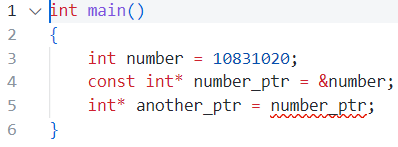
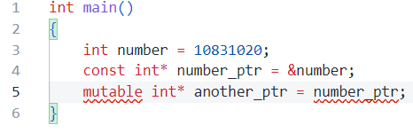

# Homework 3 part 1
 |  班級   | 姓名 |  學號   |   日期   |
 |   :---: | :---:|  :---:  |:---: |
 |四機械四乙|吳宇昕|B10831020|10/6/2022|

## Problem A
### Copy a const int pointer to non-const pointer 
[test code](CODE/Part1/HW3A.cpp)
> 欲複製const pointer，必須將其儲存於另一個const pointer。若新的pointer並非const，則會產生compile time error。
>
> 
>
> 原本預期c++的```mutable```關鍵字可以暫時避免compiler設下的這道防護機制，強迫其將```const int*```複製給```int*```但是發現這樣做沒有用。看來mutable關鍵字是專門用來讓class裡的const函式修改class member用的，無法像我這樣使用。
> 
> 

## Problem B
### Why should I pass variables as reference
[test code](CODE/Part1/HW3B.cpp) and [replit](https://replit.com/join/wogevlomwv-b10831020)
> 變數被pass by value進到函式時，將會在該函示的stack frame裡產生其數值的副本。複製體積大的變數或物件時，將會耗費CPU資源以及記憶體空間。
> 若是pass by reference，函式接收到的是該物件或變數的記憶體位置，只需要到該位置取值運算，不需要複製整個變數值進自己的stack frame。
>
> 我用```chrono```套件量測將一個含有100000個double的vector pass by value與pass by reference進到函式裡，並修改其值需花費的時間。
> vector宣告如
> ```c++
> std::vector<double> largeVtr(100000)
> ```
>
> Pass by reference 與 pass by value 宣告與參數如
> ```c++
> void passedByRef(std::vector<double>& _largeVtr)
> void passedByValue(std::vector<double> _largeVtr)
> ```
>
> 實驗使用的 [test code](CODE/Part1/HW3B.cpp)在此。
> 發現在g++ compiler優化前，各執行1000次平均兩者時間差0.0113839秒，而開啟優化```-O3```選項後，差距為0.00413375秒。若是體積更大的object需要被反覆傳入函式，更可以觀察出pass by value與pass by reference的效能差異。

## Problem C
### WHat are the difference between ```int myInt[10]``` and ```int* myInt[10]```
[test code](CODE/Part1/HW3C.cpp)
> 前者會在stack上配置一段連續的記憶體，長度40 bytes，儲存int數值。後者在stack上建立10個連續的int pointer，分別指向零散、非連續的記憶體位置。
> 後者做任何數值運算，需要dereference陣列的每個元素。未經dereference，會出現compile time error
> 
> 
> 
> 然而，原本預期dereference各個元素之後就可以對其賦值，實際操作卻出現runtime error，segmentation fault。不清楚應該如何使用```int* myint[10]```的語法，避免出錯。
> 
> 
> 
> 從vscode檢視記憶體位置，可以看見```int* arr_ptr[10]```配置的10個整數pointer指向記憶體各處，各個整數的記憶體位置凌亂。甚至不知道甚麼原因，```[0]```跟```[2]```***指向同一個記憶體位置***:
> 
> 
> 
> 對```int* myInt[10]```的語法仍然不熟悉，不清楚其應用為何。


## Problem D
### Workshop
[test code](CODE/Part1/HW3D.cpp)
> 宣告變數，得到下圖的輸出
> ```c++
>  int number = 10831020;
>  int* number_ptr = &number;
>  int* number_ptr2 = number_ptr;
> ```
> 
> 
> 
> 可以發現```&number```與```number_ptr```顯示相同的記憶體位置，而```number```與```*number_ptr```顯示相同值。```number_ptr```本身也占據記憶體位置，但是它自身的記憶體位置與```number```的記憶體位置無關，為任意數。然而其指向的記憶體位置必與```&number```相同。
> 由於```*number```沒有意義，圖中print```*number```的欄位以```N/A```代替。

## Problem E
### Overloading functions
[test code](CODE/Part1/HW3E.cpp)
> 宣告三個版本的函式，positional arguments接採用不同的type產生overload效果。呼叫函式時，compiler會以傳入的變數的type自動決定應該使用哪個版本的函式。
```c++
int DoSomething(int a, int b);
void DoSomething(int& a, int& b);
void DoSomething(int* a, int* b);
```
> 以三種call signature分別呼叫
```c++
int result = DoSomething(a, b);
DoSomething(a, b);
DoSomething(&a, &b);
```
> 發現compiler無法以有無return type的方式區別前兩種call signature分別該呼叫哪個版本的函式，因此發生compile time error。
> 