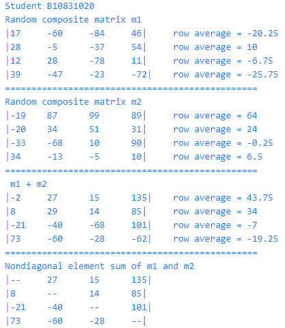
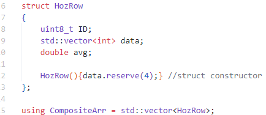
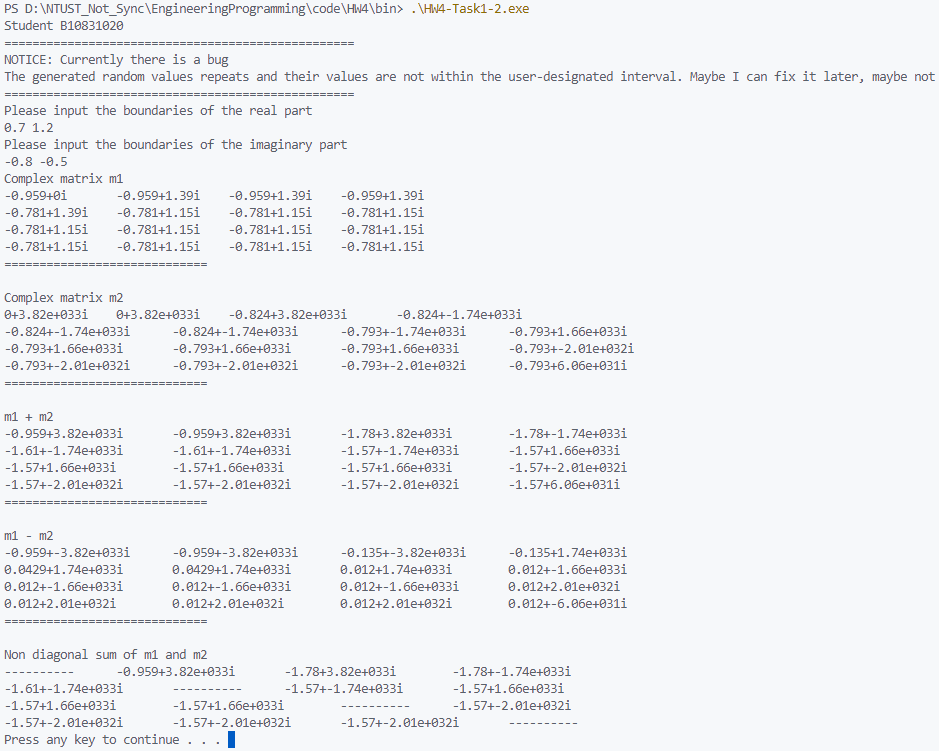
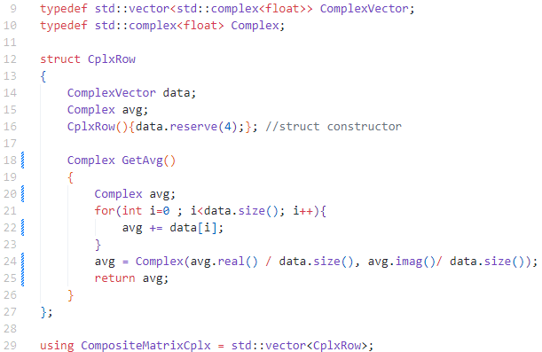

# Homework 4
 |  班級   | 姓名 |  學號   |   日期   |
 |   :---: | :---:|  :---:  |:---: |
 |四機械四乙|吳宇昕|B10831020|10/29/2022|

## Part 1: 延續HW3，有技巧的產生Struct Vector
[sorce code](CODE/HW4-Task1-1.cpp) and [replit](https://replit.com/join/ivcjhkwpfh-b10831020)

執行結果如下圖:



Struct的定義如下圖：

 

將```HozRow```當作struct vector的一列。自定義```HozRow```的constructor，當vector需要加入新的一列，會呼叫此constructor執行```reserve```函式，為此列預留記憶體空間。

寫這次的作業發現vector很有趣的一個現象。以下是為陣列賦值的函式，它會加長兩個陣列的行列數，並賦予亂數值。

```c++
void assignRandomValue(CompositeArr& m1, CompositeArr& m2)
{
    auto randGenerator = std::mt19937(time(0));
    m1.reserve(4);
    m2.reserve(4);
    for(int i = 0; i < 4; i++){
        m1.push_back(HozRow()); //calls HozRow constructor
        m2.push_back(HozRow()); //calls HozRow constructor
        for(int j = 0; j < 4; j++){
            m1[i].data.push_back(randGenerator() % 200 - 100);
            m2[i].data.push_back(randGenerator() % 200 - 100);
        }
    }
    getRowAvg(m1);
    getRowAvg(m2);
}
```
若將
```c++
m1[i].data.push_back(randGenerator() % 200 -100);
```
改為
```c++
m1[i].data[j] = randGenerator() % 200 -100;
```
程式依然可以執行，不會發生segmentation fault，且後續用```m1[i].data[j]```索引第i列j行的元素值可以順利取值。然而，若用```m1.size()```查詢其內容物數量，會發現是0。
｛
雖然vector經過```reserve()```已經配置空間可以容納新元素，仍應該用```push_back()```使其增長，而不是像上述用等號的寫法直接寫入記憶體空間。不然即使順利對vector寫入數值，它不會知道自己真實內容物量為何。如此逾越vector管理自身長度的設計，恐怕是相當糟糕的寫法。過去有一份作業是這樣寫的，很高興這次有發現此缺失。

## Part 2: 整合第三方complex API，創建複數struct vector
> __目前這份作業有嚴重的執行期錯誤__

[sorce code](CODE/HW4-Task1-2.cpp) and [replit](https://replit.com/join/zulanzrtsi-b10831020)

執行結果如下圖（執行期錯誤）:




程式有明顯的執行其錯誤，但是經過長時間的debug仍然看不出為什麼會這樣。

以圖片輸出為例，使用者輸入實數與虛數上下界浮點數，但是產生的亂數即使經過處理仍沒有落在指定範圍內，而且是很詭異的數值。還有，各個元素實部與虛部皆應是亂數，然而實際輸出看見好幾的元素的值是重複的。兩個問題經過長時間debug仍無法解決。

struct 定義如下圖：



自定義```CplxRow```的constructor與計算列平均的函式```GetAvg()```。計算平均的函式本來想寫成
```c++
Complex GetAvg()
{
    Complex avg;
    for(int i=0 ; i<data.size(); i++){
        avg += data[i];
    }
    avg /= (int)data.size();
    return avg;
}
```
卻發現```/=```運算子沒辦法在```std::complex<float>```與```int```之間使用。在[cppreference.com網站](https://en.cppreference.com/w/cpp/numeric/complex/operator_arith3)上看到這句話
> Because template argument deduction does not consider implicit conversions, these operators cannot be used for mixed integer/complex arithmetic. In all cases, the scalar must have the same type as the underlying type of the complex number.

顯然目前這兩種type之間的變數無法使用這個運算子，那就只好向圖片裡一樣寫得土炮一點。

## Part 3: 觀照視頻心得
這部影片主要介紹C++的class如何自訂義operator。其實operator似乎只是變形的函式，只是以更簡潔的符號形式達到相加、相減、比較等計算結果。

兩複數相加時，普通的class內函式可能長這樣
```c++
Complex Complex::add(const Complex& another)
{
    return Complex(this->real() + this->real(), another.imag() + another.imag());
}
```
而呼叫此函示需寫成
```c++
Complex c1, c2, c3;
c3 = c1.add(c2); // assume = operator is already availabe
```
但是若在```class Complex```自訂義+運算子，兩個複數相加的程式將會看起來更簡潔
```c++
Complex Complex::operator + (const Complex anotherCplx) const
{
    return Complex(this->real()+anotherCplx.real(), this->imag()+another.imag())
}
```
使用+運算子複數相加只需要
```c++
Complex c1, c2, c3;
c3 = c1 + c2; // assume = operator is already available
```
定義+運算子有幾個關鍵字，其實跟定義函式語法很類似：
* ```Complex```: 運算子(函式)回傳一個Complex物件
* ```Complex```::operator +:修改Complex class的+運算子
* ```(const Complex anotherCplx)```: 此函式需要輸入兩個參數，不過第一個參數即呼叫此運算子時在+前的Complex物件，會暗中自動傳入不需要在參數列標示。上例中的```c1```即是第一個參數，在函式內文為```this```。而第二個參數被pass by const reference，即上例的```c2```，函式內文為```anotherCplx```。
* ```const```: 此函式不會修改第一個參數物件```c1```內容，故在函式宣告同一行最後標記```const```

## Part 4: 重點回顧下列影片，寫出80字心得
> 我其實找不到該影片
### __A. Python OOP__
Python讓使用者自由選擇是否使用OOP語法寫程式，不像C#或Java一定要求每個主程式要包覆在namespace、class裡面。

與其像C++在class裡使用```public```、```private```、```protected```等access modifiers，它以變數的名稱判別各個attribute的accessibility。
* attribute 名稱前沒有_ : public attribute
* 名稱前帶有_  : private attribute
* 名稱前大有__ : protected attribute

兩個語言皆提供inhertance，但是python似乎不提供function overload。

Python class內的函式若需修改一個instance，該函式第一個參數必須傳入```self```。若不修改instance而是單純把一個函式寫在class內，則可以標註```@classmethod```或```@staticmethod```。C++沒有這種機制，所有class內的函式無論是否修改instance都長一樣。

### __B. C語言陣列，了解heap空間變化__
程式可以把變數存在兩種不同記憶體，stack或是heap。
|特性|Stack|Heap|
|:---|:---:|:---:|
|自動清除變數|有|無|
|CPU效率|較高|較低|
|可用空間|較小|較大|

C++與C若宣告變數時沒有特地使用new關鍵字，該變數就會存在stack裡；反之，就會存在heap。除非需要在local function創建一條array，或是程式需要儲存體積龐大的物件，將變數儲存在stack上應該是較好的選擇。

由於heap裡的物件不會在function call結束或scpoe結束時被清除，很容易產生memory leak霸佔電腦的記憶體空間。同時，stack記憶體裡所有變數儲存位置相鄰，heap可能儲存在任何凌亂的位置，CPU需要到某個stack位置取值計算更有效率。

即使我們寫的作業幾乎不需要用到new關鍵字，不需要手動操作heap記憶體，其實四次作業都有用到vector就是在讀寫heap記憶體。由於vector長度不固定，其必須被儲存在heap才有這樣的靈活度，因此vector設計上一律儲存在heap。但是為了避免memory leak，它同時也被設計當它go out-of-scope，會自動呼叫destructor，清除相關的heap記憶體內容。