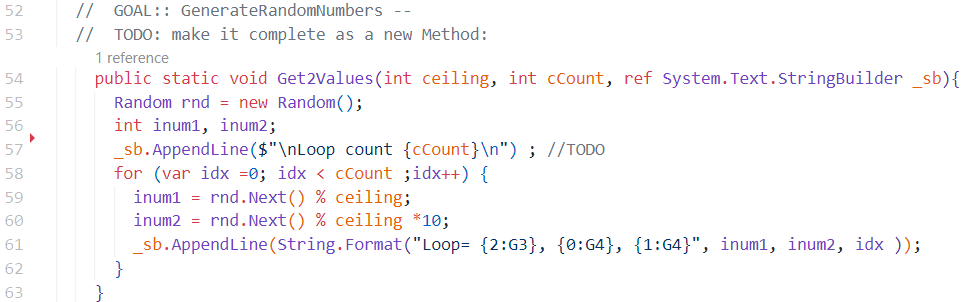

# HW6 
 |  班級   | 姓名 |  學號   |   日期   |
 |   :---: | :---:|  :---:  |:---: |
 |四機械四乙|吳宇昕|B10831020|12/10/2022|

 ## Q0 Main2Tuple
 [sorce code](Q0/Main2Tuple.cs) and [replit]()

 __終端機輸出__

 

將```Get2Values```寫成獨立函式，去除零散的```Console.WriteLine()```程式碼。在```Main```產生```StringBuilder```物件，並搭配```ref```關鍵字傳進此函式。



__心得__

C#的Tuple用法很多元。可以幫每個tuple內的元素命名，形成類似struct或dictionary以欄位名稱索引的資料結構。

然而其方便性仍遠不如Python的tuple。不清楚為什麼，C#的tuple不支援foreach loop，也不支援以index取值，必須要用```.item1```，```.item2```的方式取出第一與第二個元素值。

像是這樣的語法，在C#行不通
```C#
var t = (23, 66, 22); // creating a tuple<int, int, int>
Console.Write(t[0]);  // unable to get the value 23 by indexing 0
```
必須要寫成這樣
```C#
var t = (23, 66, 22); // creating a tuple<int, int, int>
Console.Write(t.Item1);  // get the value 23 by ".Item1"
```
tuple不支援indexing跟foreach迴圈，恐怕不適合被迴圈走訪。或許C#的Tuple設計上並不打算讓我們這樣做？或是其實有正確的作法，但是我還沒學到。目前看起來，它最適合打包函式的回傳值。這讓C#的函式看起來可以像Python的函式一次回傳多個值，在接收回傳值的地方利用類似Python unpacking語法，輕鬆拆封tuple。

## Q3A

[sorce code](Q3/Q3A.cs)

__終端機輸出__


__計算最長距離__

題目給7個點的x,y座標，求最遠兩點的距離。求解過程如下：

1. 找出擁有最大與最小x,y座標值的四個點，最遠距離一定是此四點其中兩點距離
2. 設一變數紀錄最長距離
3. 計算此四點兩兩之間的距離，若當下的兩點距離大於紀錄的最長距離，就取而代之

__心得__

計算歐式距離需要開根號，耗費較多計算資源，應盡可能降低開根號次數。若要計算每一個點與其他點之間的距離，須至少開C(7,2)次根號。但是確定最大距離一定發生在四個邊界點之間，只需要計算四個邊界點兩兩之間的距離，開C(4,2)次根號就夠了。若題目加入更多點的座標，不會增加開根號次數。

或許這個題目還有更好的解法，進一步減少計算成本，但目前我只想到這個做法。

## Q3B

[sorce code](Q3/Q3B.cs)

__終端機輸出__


__心得__

C#有個很好用的關鍵字```readonly```，讓一個class attribute的值經初始化後便改為唯讀，不可變更。這比C++的```const```關鍵字好用，因為一個const member沒辦法初始化賦值。
C#好像不讓我們把的class member設為const，若要一個class member值固定不變，必須用readonly。因此這題我把學生的成績設為```readonly int[,]```，放在```class Program```裡面。


## Q4

sorce code [main.cs](Q4/main.cs)  [Deck.cs](Q4/Deck.cs)  [Card.cs](Q4/card.cs)

三份cs檔分別包含```class Program```、```class Deck```及```class card```，皆屬於```namespace Q4```

___終端機輸出___


__自定義Card物件__

```C#
namespace Q4
{
    class Card
    {
        public readonly static string[] sSuit = {"berry", "flower", "diamond", "heart"};
        public readonly static string[] sNumber = {"A", "2", "3", "4", "5", "6", "7", "8", "9", "10", "J", "Q", "K"};
        public readonly int SuitIdx;
        public readonly int numberIdx;
 
        public Card(int _suitIdx, int _numberIdx)
        {
            this.SuitIdx = _suitIdx;
            this.numberIdx = _numberIdx;
        }
    }
}
```


每張牌都有一個花色與一個數值，兩者都是string。然而，過去似乎聽說string是指向heap的char pointer，在程式裡生成過多string物件容易使記憶體零散。因此，每張牌的花色與數值欄位我並沒有用string的方式儲存，以int儲存，作為索引另外兩個static string array的索引值。

不知道這樣做是否真的可以提升程式效能，減少記憶體零散，或是只是我自找麻煩？後續要印出一張牌的內容時，增加了不少困擾，要寫成這樣：

```C#
Card c = new Card(3, 11);
Console.WriteLine($"{sSuit[c.SuitIdx]}--{sNumber[c.numberIdx]}")
// diamond--J
```

而不是這樣：

```C#
Card c = new Card(3, 11);
Console.WriteLine($"{c.Suit}--{c.Number}");
// diamond--J
```

我的寫法大幅減少可讀性，不知道是否真的能像我想像的一樣增進效能。