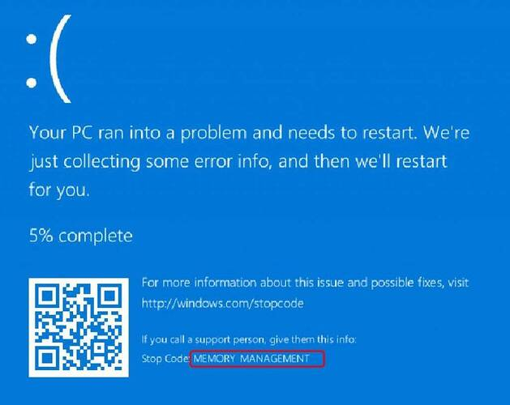

# HW6 
 |  班級   | 姓名 |  學號   |   日期   |
 |   :---: | :---:|  :---:  |:---: |
 |四機械四乙|吳宇昕|B10831020|12/20/2022|

## Q1

__說明C++/C#語言異同點__

1. Memory management
> C#的class object預設存在heap，C++預設存在stack
> 
> |   |stack|heap|
> |---|:---:|:---:|
> |空間大小|小|大|
> |是否連續|是|否|
> |讀寫速率|快|慢|
> |自動管理空間|是|否|
> 
> 在C++，存在heap記憶體的物件，使用完了需要手動用```delete```關鍵字清除，像是這樣
> ```C++
> int* myInt_ptr = new int; // allocate an int on heap
> *myInt_ptr = 100;
> delete myInt_ptr // manually freeing memory on heap
> ```
> 或是用smart pointer讓compiler知道何時使用完畢，在哪裡可以自動call destructor。像是這樣:
> ```C#
> int* foo(){
>   std::make_shared<int> myInt_ptr = new int;
>   *myInt_ptr = 0;
>   return myInt_ptr; // return an int smart pointer
>   // if no other pointer in other scope holds reference to this int
>   // smart pointer will call automatically free the memory
> }
> ```
> 如果在C++沒有用這兩種方法清除heap記憶體空間，會發生memory leak。電腦的記憶體一直被佔據，所有可用空間都被占滿後很可能會當機顯示windows blue screen of death
> 
>
> 然而，C#有garbage collector的設計。有許多runtime support機制可以隨時檢查哪個物件或記憶體區段已經失去所有reference，自動銷毀沒有reference的物件。
>
> 若有需要，C#也可以用```fixed```搭配```unsafe```關鍵字在一個scope以內宣告某個物件是神聖不可侵犯的，避免garbage collector銷毀失去reference但其實還需要用到的物件。
> ```C#
> unsafe{
>     fixed(int* myInt_ptr = 0b1010010) // garbage collector will not free muyInt_ptr
>     {
>         *myInt_ptr = 0; // write 0 to memory location 0b1010010
>     }
> }
> ```
2. Runtime support
> C#程式需要大量的runtime support，連結外部的```dll```才可以正常運作。然而C++幾乎把所有運作必要的內容在compile time都囊括進exe檔了。
>
> 因此，C++比C#更適合用於單晶片控制器、嵌入式系統等效能有限，無法支援太多runtime support機制的電腦。
3. Cross Platform
> C++是單純的compiled language，而C#同時是compiled language也是interpreted language。
>
> C++的compiler會直接把sorce code轉成CPU可以讀取的machine code。C#的compiler會把sorce code先轉成intermediate representation(IR)，到了runtime才把IR用interpreter執行，或是用just-in-time compiler再次編譯成machine code。
>
> 因此，C#比C++更適合做跨平台開發。分送C#的IR給目標電腦，無論該電腦作業系統為何，只要有需要的runtime support就可以把IR轉換成最適合該電腦的machine code執行。C++卻需要在compile time決定輸出的machine code要給哪種作業系統使用。只能為每個作業系統compile出專屬該作業系統的machine code，或是直接分送sorce code到目標電腦去compile成它的machine code，變成open sorce程式。

||C++|C#|
|---|:---:|:---:|
|memory management|高自定性但手動|受限制而自動管理|
|runtime support|幾乎不需要|大量需要|
|cross platform|困難|容易|

## Q2 Tuple的意義
> C#的value tuple有點像是Python的tuple，可以用簡單的```()```符號打包多個變數，讓函式一次回傳多個數值。一個C#的tuple例子是這樣:
> ```C#
> // C# calling a function retruning 2 ints in a tuple
> static void Main(string[] args){
>     (int Min, int Max) = FindMinMax(); // receive and deconstruct a returned tuple 
> }
> static (int min, int max) FindMinMax(){
>     int[] arr = new int[]{ 1, 2, 4, 5, 21, 22 };
>     return (arr.Min(), arr.Max()); // creating a tuple with () and return
> }
> ```
> 而Python的例子是這樣:
> ```Python
> # Python calling a function returning 2 ints in a tuple
> def FindMinMax() -> tuple:
>    my_list = [1, 2, 4, 5, 21, 22]
>    return (my_list.min(), my_list.max()) # packaging a tuple
> 
> (Min, Max) = FindMinMax() # unpackaging a tuple
> ```
> 但是不一樣的地方在於，Python的Tuple可以被index索引，也可以被迴圈走訪；C#的tuple沒有這兩個功能。
> ```Python
> # Python indexing into tuples and iterating with loops
> my_tup = (1, 2, 3, 2, 6, 11, 92)
> print(my_tup[4]) # prints 6
> for val in my_tup:
>    print(val) # prints everything in the tuple
> ```
> ```C#
> // C# indexing tuple with [] does not work
> static void Main(string[] args){
>   var myTup = (2, 0, 4);
>   Console.WriteLine(myTup[2]); // error: cannot apply indexing [] to type (int, int, int)
> }
> ```
> ```C#
> // C# iterating tuple with foreach loop does not work
> static void Main(string[] args)
> {
>     var myTup = (2, 0, 4);
>    // error: type (int, int, int) does not contain extension definition or instance for GetEnumerator method
>     foreach(var val in myTup){ 
>         Console.WriteLine(val);
>     }
> }
> ```
> 看錯誤訊息內容，似乎是可以為```(int, int, int)```定義一個```GetEnumerator``` method，讓這個foreach loop可以用? 可能需要另外寫```public System.Enumerator overwrite GetEnumerator::(int, int, int)```之類的method。
> 
> C#的tuple也有點像是C++的struct，但是幫你省去了需要定義struct的困擾。C++的tuple宣告起來有點麻煩，程式碼不如C#簡潔。總之，讓函式回傳多個數值應該是C# Tuple的主要用途。可能我寫C#的時候，會選擇像C++一樣設計帶有output variable參數的函式，達到函式回傳多值的效果。

## Q3A

[sorce code](Q3/Q3A.cs) and [replit](https://replit.com/@b10831020/HW6-Q3A#main.cs)

__終端機輸出__


__計算最長距離__

題目給7個點的x,y座標，求最遠兩點的距離。求解過程如下：

1. 找出擁有最大與最小x,y座標值的四個點，最遠距離一定是此四點其中兩點距離
2. 設一變數紀錄最長距離
3. 計算此四點兩兩之間的距離，若當下的兩點距離大於紀錄的最長距離，就取而代之

__心得__

計算歐式距離需要開根號，耗費較多計算資源，應盡可能降低開根號次數。若要計算每一個點與其他6個點之間的距離，須至少開C(7,2)次根號。但是可以確定最大距離一定發生在四個邊界點之間，只需要計算四個邊界點兩兩之間的距離，開C(4,2)次根號就夠了。若題目加入更多點的座標，不會增加開根號次數。

尋找四個邊界點所需的時間會隨題目的點數增加線性上升，比起指數型上升是相當大的改善。

或許這個題目還有更好的解法，進一步減少計算成本，目前這是我想到最好的做法。

## Q3B

[sorce code](Q3/Q3B.cs) and [replit](https://replit.com/@b10831020/HW6-Q3B#main.cs)

__終端機輸出__


__心得__

C#有個很好用的關鍵字```readonly```，讓一個class attribute的值經初始化後便改為唯讀，不可變更。這比C++的```const```關鍵字好用，因為一個const member沒辦法初始化賦值。
C#好像不讓我們把的class member設為const，若要一個class member值固定不變，必須用readonly。因此這題我把學生的成績設為```readonly int[,]```，放在```class Program```裡面。


## Q5

sorce code [main.cs](Q5/main.cs)  [Deck.cs](Q5/Deck.cs)  [Card.cs](Q5/card.cs) [Player.cs](Q5/Player.cs) and [replit](https://replit.com/@b10831020/HW6-Q5#main.cs)

三份cs檔分別包含```class Program```、```class Deck```、```class card```及```class Player```，皆屬於```namespace Q5```

___終端機輸出___


### __自定義Card class__

```C#
class Card
{
    private readonly static string[] sSuit = {"Spade", "Club", "Diamond", "Heart"};
    private readonly static string[] sNumber = {"A", "2", "3", "4", "5", "6", "7", "8", "9", "10", "J", "Q", "K"};
    private int suitIdx;
    private int numberIdx;

    public string Suit => sSuit[this.suitIdx]; // custom get accessor for suit of a card
    public string Number => sNumber[this.numberIdx]; // custom get accessor for Number of a card

    /// <summary>
    /// Create an instance of a card.
    /// </summary>
    /// <param name="_suitIdx">The index to retrieve the suit of this card as a string from array Card.sSuit</param>
    /// <param name="_numberIdx">The index to retreve the number of this card as a string Card from array Card.sNumber.</param>
    public Card(int _suitIdx, int _numberIdx)
    {
        this.suitIdx = _suitIdx;
        this.numberIdx = _numberIdx;
    }

    public override string ToString()
    {
        return string.Format("{0,2}--{1,-9}", this.Number, this.Suit);
    }
}
```


每張牌都有一個花色與一個數值，兩者都應該是string。然而，過去似乎聽說string是指向heap的char pointer，在程式裡生成過多string容易使記憶體零散。因此，每張牌的花色與數值欄位我並沒有用string的方式儲存，而是以int儲存，作為索引另外兩個static string array ```sSuit```與```sNumber```的索引值。如此一來，每個card instance只佔據記憶體連續的16個byte。 也就是說，每個instance的```this.Suit```跟```this.Number```並不佔據記憶體空間，它們只是個method，被呼叫的時候去索引```Card.sSuit```跟```Card.sNumber```陣列，回傳一個字串。

有了這兩個accessor，即使每個card instance並沒有真正的```this.Number```跟```this.Suit```兩個attribute，也可以對一個card instance打點簡單取出它的數值跟花色。

```C#
Card c = new Card(2, 10);
Console.WriteLine($"{c.Number}--{c.Suit}"); // call the accessors of Number and Suit
// Diamond--J
```

不知道這樣做是否真的可以提升程式效能，減少記憶體零散，或是只是我自找麻煩？

### __自定義Deck class__

含有一個長度52的```Card```陣列```this.AllCards```，代表整副牌的所有卡片。

__```Deal```方法__

發牌的方法```this.Deal``` pass by reference輸入一個玩家陣列，發兩張牌給每位玩家。每個Deck instance都會用一個int ```this.lastGivenCardIdx```記錄自己```this.AllCards```陣列發到第幾張牌了，避免一張牌在不同次發牌間重複出現。發牌時，一律從洗好的牌組抽出最上面的一張牌發給玩家，從```this.AllCards```陣列第0張牌發到最後一張。

```C#
public void Deal(ref Player[] _players, int nCardsEachPerson = 2)
{
    Card[] cardsGivenToAPlayer = new Card[nCardsEachPerson];
    if (!this.shuffledFlag){
        // each deck of card must be shuffled before deal
        throw new CardsNotShuffledException(); 
    }
    for (int i = 0; i < _players.GetLength(0); i++) {
        for (int j = 0; j < nCardsEachPerson; j++){
            cardsGivenToAPlayer[j] = AllCards[lastGivenCardIdx];
            lastGivenCardIdx++;
        }
        _players[i].ReceiveCards(cardsGivenToAPlayer);
    }
}
```

這個發牌的方法在牌發完的時候會產生index out of range exception，玩家人數或每個人拿到的牌數量太多時會出問題。

另外，自定義了```CardsNotShuffledException```。若程式還沒有call ```this.Shuffle()```方法洗牌，就call ```this.Deal```發牌，會丟出一個自定義的exception。


### __自定義Player class__

每個Player instance只有一個attribute，是```List<Card>```，代表該玩家的手牌。除此之外，Player class也定義了一些method，例如```ReceiveCard```、```ShowCard```等等，代表玩家可能做的事。還有一個static method ```AllPlayersShowCards```，輸入一個玩家陣列，顯示所有玩家的手牌。

__心得__

C#確實比C++好寫很多。有了accessor的設計跟簡易的getter, setter，讀寫class內容的程式碼變得很簡單。

唯一比較想抱怨的，是C#不太讓我們把物件存在stack上，而且所有物件都需要一個個初始化。像是我的```Player```陣列：
```C#
Player players = new Player[3];
```
這樣寫只有初始化陣列本身，而沒有初始化到陣列裡的player instance。要走訪這個陣列，初始化一個個player instance，甚至不能用foreach loop。這樣寫行不通
```C#
foreach(Player p in players){
    p = new Player();
    // p is a foreach loop variable, cannot be reassigned 
    // or initialized
}
```

必須用傳統的for loop，寫成這樣:
```C#
for(int i = 0; i < players.Count(); i++){
    players[i] = new Player();
}
```
創建instance的程式碼比C++ stack-allocate物件複雜，但這恐怕是在C#或Java都無法避免的。

## Q6

使用Q5的程式碼測試vscode intellisense跟debugging功能。使用dotnet sdk 7.0，建置vscode開發環境。

### __Compile time error__
C#每個物件都需要用```new```關鍵字初始化。下圖是我創建了一個Player陣列，稱為```player```，卻沒有使用```new```初始化陣列本身。當我試圖把這個陣列拿來用，傳進別的method時，vscode intellicense在compile time就劃紅線顯示錯誤訊息，告訴我這個陣列尚未初始化。

雖然不太清楚為甚麼錯誤訊息是說*Use of unassigned local variable*而不是*uninitialized local variable*。


第10行加上```new```關鍵字後，紅線就消失，可以編譯了。
```C#
Player[] players = new Player[3];
```

### __Run time error__

剛才的player陣列本身加上```new```關鍵字以後成功初始化了，但是裡面的元素，一個個Player instance沒有初始化，造成*NullReference Exception*


查看vscode debug工具列裡面的local variable watch視窗，可以看到陣列本身存在，但是裡面的三個元素還是```null```


在別處用for loop走訪這個陣列，初始化每個元素後就解決了這個run time error。

```C#
for(int i = 0; i < 3; i++){
    players[i] = new Player();
}
```

### __Xml-style comments__

書裡有提到C# xml-style comment的功能，試著幫Q5的程式碼加上一些註解。


同一個C# project使用到這個method的地方，只要把游標移到函式名稱上方，就會依summery, output, parameter自動顯示xml comment的內容。


但是有點疑惑的是，它只有顯示出```<summery></summery>```的內容，其他像```<para name></para name>```裡的，都沒有顯示出來。不知道我是哪裡做錯了，還是有什麼vscode套件的問題。

### __Break point__

過去只知道break point可以讓程式執行到那裏就停下來，不知道還有conditional breakpoint這種東西。過去曾經遇到一個問題，走訪陣列的迴圈走到1000次的第894次時，總是發生runtime error。有conditional breakpoint，就可以在第893次的時候停下來，開始用step into功能單步執行，這樣更方便。

### __心得__

vscode的intellisense非常人性化，可以自己用xml語法控制註解內容真是一大福音。加上精心設計```task.json```跟```launch.json```的內容，f5一按下去就自動編譯並開始偵錯程式，一切流程自動化太方便了。

更棒的是，vscode免費。